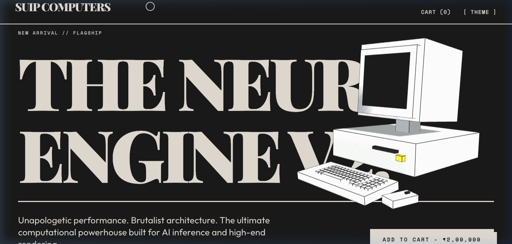
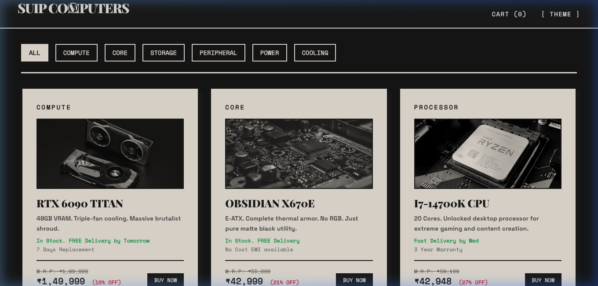

# SUIP COMPUTERS - Premium Hardware E-Commerce

Welcome to the **SUIP COMPUTERS** repository! This is a brutalist, high-performance E-Commerce storefront designed for high-end computational hardware, GPUs, and peripherals. Built for a Hackathon project, this platform blends a minimalist "Neubrutalist" aesthetic with smooth interactions and 3D web graphics.

## 🚀 Live Demo

**[Click here to view the Live Website](https://tejuas98.github.io/suip/)**

---

## ✨ Features

- **Brutalist Design System:** Heavy borders, stark contrasts, monospace typography, and industrial aesthetics.
- **Dark/Light Mode:** A flawless toggle between pure dark mode and high-contrast light mode with GSAP flash animations.
- **3D Interactive Hero:** A fully rendered, interactive Three.js retro computer model that tracks cursor movement.
- **Dynamic Product Filtering:** Filter through our catalog (Compute, Core, Storage, Peripherals, Cooling) instantly.
- **Working Cart & Checkout:** A brutalist side-cart and a full checkout modal with shipping and address forms.
- **Responsive Layout:** Perfectly optimized for mobile, tablet, and desktop screens using TailwindCSS grids.

---

## 📸 Screenshots

*(Replace the placeholder below with your actual screenshot)*

*(Replace the placeholder below with your actual screenshot)*

---

## 🎥 Video Playback

*(Replace the placeholder below with your actual video or GIF showing the 3D model and scroll effects)*

> **Instructions for the developer:** 
> 1. Record your screen while scrolling through the site and interacting with the 3D model.
> 2. Save the recording as `demo.gif` or `demo.mp4` and upload it to the root of this repository.
> 3. Take two screenshots (`screenshot-hero.png` and `screenshot-catalog.png`) and upload them here!

---

## 🛠️ Tech Stack

- **HTML5** (Semantic structure)
- **TailwindCSS** (Utility-first styling, responsive design, brutalist borders)
- **Vanilla JavaScript** (Cart logic, filtering logic, modal toggling)
- **GSAP & Lenis** (Smooth scrolling, stagger animations, high-performance transforms)
- **Three.js** (WebGL rendering for the interactive 3D hero component)

---

## 📦 Deployment

This project is deployed using **GitHub Pages**. Every push to the `main` branch automatically updates the live URL!

---
*Built with unapologetic performance and brutalist architecture.*
